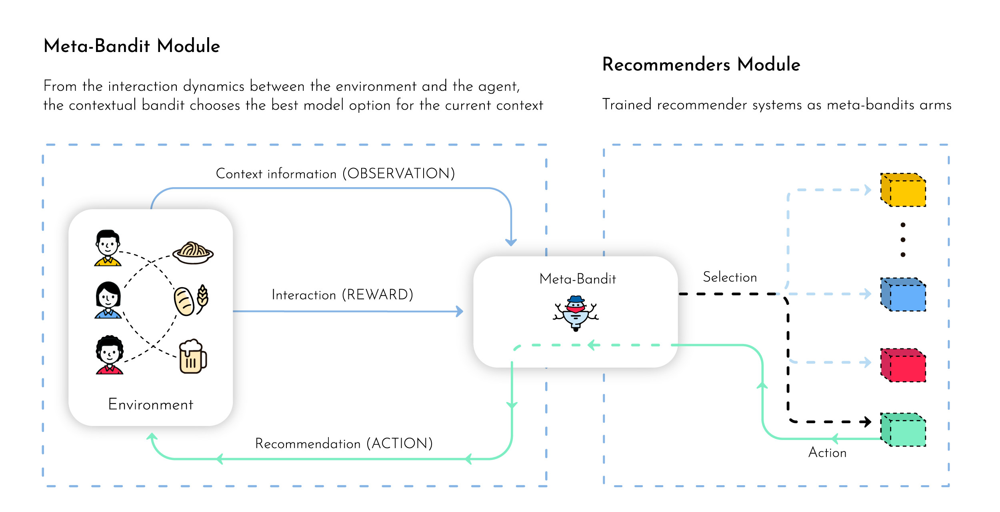
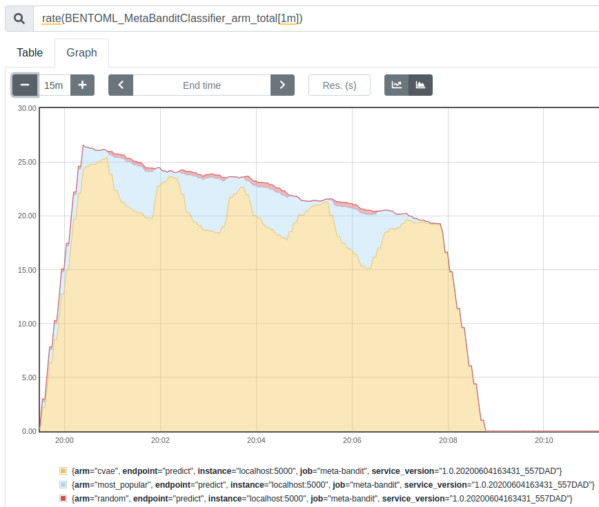

# Contextual Meta-Bandit Selection

The Contextual Meta-Bandit (CMB) can be used to select models using the context with online learning based on Reiforcement Learning problem. It's can be used for recommender system ensemble, A/B test, and other dynamic model selector problem.

https://vimeo.com/456553645



For each interaction, the environment provides an observation (which contains contextual information). The Meta-Bandit uses it to select one of the recommenders and let the selected one decide the action (recommender item). The environment receives this action and calculates the reward given to the Meta-Bandit.

# Requirements
- python=3.6.7
- pandas=0.25.1
- scipy=1.3.1
- numpy=1.17.0
- scikit-learn=0.21.2
- requests=2.18.4
- unidecode==1.1.1
- creme==0.5.1
- bentoml==0.7.8
- pyyaml
- responses==0.10.14
- prometheus_client

# Installation

CMB can be installed using conda:

```bash
>>> conda env create -f environment.yml
>>> conda activate meta-bandit-selector
```

# Usage

## Configuration

#### config.yml

```yaml
arms:
  arm1: http://arm.localhost/predict
  arm2: http://arm.localhost/predict
  arm3: http://arm.localhost/predict
bandit_policy_params:
  epsilon: 0.1
  seed: 42
```

## Bandit Polity

We implemented two different policies for the bandit.

* **e-greedy** (policy/e_greedy.py)
* **Softmax** (policy/softmax.py)

## Deploy Meta-Bandit

```bash
>> python package.py --h

usage: package.py [-h] [--config-path CONFIG_PATH]
                  [--polity-module POLITY_MODULE] [--polity-cls POLITY_CLS]

Process some integers.

optional arguments:
  -h, --help            show this help message and exit
  --config-path CONFIG_PATH
  --polity-module POLITY_MODULE
  --polity-cls POLITY_CLS

```

Example of Package meta-bandit with e-greedy:

```bash
>> python package.py \
      --config-path config/config_egreedy.yml \
      --polity-module policy.e_greedy \
      --polity-cls EGreedyPolicy
```

### Start server

```bash
>> bentoml serve MetaBanditClassifier:latest
```

## Endpoints

### POST /predict

In the prediction it is necessary to send the context information that will be used by the meta-bandit and the arm's input.

#### Payload Format
```json
{
  "context": {
    // context information for Meta-Bandit
  },
  "input": {
    // input arms 
  }
}
```


#### Example
```bash
curl -i \
  --header "Content-Type: application/json" \
  --request POST \
  --data '{
  "context": {
    "f1": 1,
    "f2": 0
  },
  "input": {
    "user": 1,
    "items": [
      0,
      1,
      3,
      7,
      4,
      6,
      5,
      2
    ]
  }
}' \
  http://localhost:5000/predict
```
Request result:

```json
{
  "result": {..}, // Arm Result
  "bandit": {
    "arm": "arm1"
  }
}
```

### POST /update

The /update method should be used to update the meta-bandit oracle for online learning. The result of the past action, containing the context and the reward, must be sent to the meta-bandit.

#### Payload Format
```json
{
  "context": {
    // context 
  },
  "arm": "arm1",
  "reward": 1
}
```

### GET /metrics

we use prometheus.io to monitor the meta-bandit. It is possible to monitor the performance metrics of the oracle and the execution of each arm.

#### Oracle Metric

```
BENTOML_MetaBanditClassifier_oracle_metric_sum
BENTOML_MetaBanditClassifier_oracle_metric_count
BENTOML_MetaBanditClassifier_oracle_metric_create
```

#### Selected Arms

```
BENTOML_MetaBanditClassifier_arm_total
```

Example of arm exploration in a recommendation system:




## Examples

....


## Test

```bash
>> python -m unittest tests/src/test_*
```

## Cite us
Please cite the associated paper for this work if you use this code [Paper]:
```
@inproceedings{santana2020contextual,
  title={Contextual Meta-Bandit for Recommender Systems Selection},
  author={Santana, Marlesson RO and Melo, Luckeciano C and Camargo, Fernando HF and Brand{\~a}o, Bruno and Soares, Anderson and Oliveira, Renan M and Caetano, Sandor},
  booktitle={Fourteenth ACM Conference on Recommender Systems},
  pages={444--449},
  year={2020}
}

Paper: https://dl.acm.org/doi/10.1145/3383313.3412209
```

## License

Copyright ---

Licensed under the Apache License, Version 2.0 (the "License"); you may not use this file except in compliance with the License. You may obtain a copy of the License at http://www.apache.org/licenses/LICENSE-2.0

Unless required by applicable law or agreed to in writing, software distributed under the License is distributed on an "AS IS" BASIS, WITHOUT WARRANTIES OR CONDITIONS OF ANY KIND, either express or implied. See the License for the specific language governing permissions and limitations under the License.